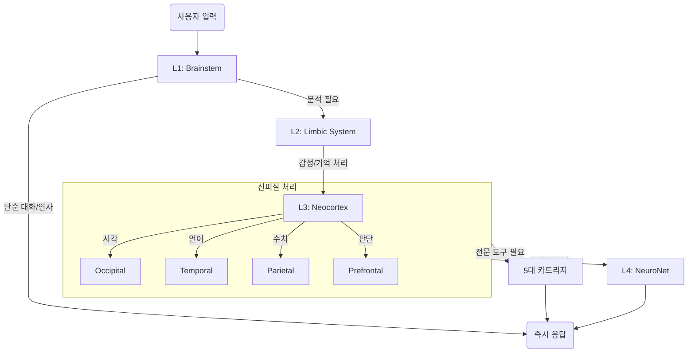

# 🧠 **SHawn-Brain D-CNS Architecture (v5.5)**

### **Digital Central Nervous System Specification**

> **문서 상태**: Active (2026-02-02)
> **적용 버전**: v5.5.0
> **핵심 변경**: 엔진 매핑 최적화 (Groq, Claude, DeepSeek 도입)

---

## 1. 개요 (Overview)

SHawn-Brain의 **D-CNS (Digital Central Nervous System)**는 생물학적 뇌의 효율적 정보 처리 방식을 모방한 4계층 하이브리드 AI 아키텍처입니다. 단일 거대 모델에 의존하는 대신, 역할에 특화된 여러 모델(Engine)이 유기적으로 협력하여 속도, 정확성, 창의성의 균형을 극대화합니다.

---

## 2. 4계층 신경망 구조 (Neural Layers)

### **L1: Brainstem (뇌간)** - [Reflexive Layer]
*   **역할**: 생존 호흡, 초기 신호 감지, 반사적 반응, 입력 검증
*   **Engine**: **Groq (Llama-3.1-70b-versatile)**
*   **특징**:
    *   **Ultra-Low Latency (<100ms)**: 사용자의 입력을 즉시 인지하고 반응.
    *   **Filter**: 유해하거나 무의미한 입력을 1차적으로 필터링.
    *   **Router**: 신호를 상위 계층으로 보낼지 즉시 처리할지 결정.

### **L2: Limbic System (변연계)** - [Affective Layer]
*   **역할**: 감정 처리, 공감, 기억 연관성 판단, 주의(Attention) 분배
*   **Engine**: **Gemini-2.5-pro (Main) / Claude-3-Opus (Sub)**
*   **특징**:
    *   **Emotion IQ**: 사용자의 감정 상태와 의도(Intention)를 파악.
    *   **Safety**: 윤리적 판단 및 위험 감지.
    *   **Context**: 대화의 맥락을 유지하고 기억(Memory)과 연결.

### **L3: Neocortex (신피질)** - [Cognitive Layer]
*   **역할**: 고등 인지, 논리적 분석, 전문 작업 수행, 도구 사용
*   **Engine**: **4-Lobe Cooperative Model (Gemini-2.5-pro Core)**
*   **구조 (4엽 협력 모델)**:
    1.  👁️ **Occipital (후두엽)**: 시각 정보 처리 (이미지, 차트) → *Bio, Astro Cartridge*
    2.  👂 **Temporal (측두엽)**: 언어, 의미, 청각 정보 처리 → *Lit Cartridge*
    3.  📍 **Parietal (두정엽)**: 공간, 수치, 논리적 통합 → *Quant, Inv Cartridge*
    4.  🤔 **Prefrontal (전두엽)**: 의사결정, 계획, 실행 제어 → *Executive Control*

### **L4: NeuroNet (신경망)** - [Reasoning Layer]
*   **역할**: 집단지성, 초고도 추론, 메타 인지, 코딩 및 아키텍처 설계
*   **Engine**: **DeepSeek-Coder(v2) / Gemini-Exp-1206**
*   **특징**:
    *   **Deep Reasoning**: 복잡한 문제를 단계별로 추론(CoT).
    *   **Coding**: 시스템 자체 코드 수정 및 기능 확장.
    *   **Meta-Cognition**: 자신의 답변을 다시 검토하고 최적화.

---

## 3. 정보 처리 흐름 (Signal Flow)

---

## 4. 5대 카트리지 (Specialized Cartridges)

신피질(L3)의 기능을 확장하는 도메인 특화 모듈입니다.

| 카트리지 | 도메인 | 주요 엔진 | 상응 뇌 부위 |
| :--- | :--- | :--- | :--- |
| **Bio** | 생물학 (세포/오가노이드) | Gemini-Pro Vision | Occipital + Temporal |
| **Inv** | 투자/시장 분석 | Gemini-Pro + Finance API | Prefrontal + Parietal |
| **Lit** | 문학/논문 분석 | Claude-Opus / Gemini | Temporal + Prefrontal |
| **Quant** | 정량/통계 분석 | Python (Pandas/SciPy) | Parietal |
| **Astro** | 천문/우주 데이터 | Gemini + NASA API | Occipital + Parietal |

---

## 🛡️ Safety Mechanisms (데이터 유출 방지책)

사용자님께서 걱정하시는 "병합(Merge) 시 데이터 혼입"을 막기 위한 3중 필터입니다.

### 1. `.gitignore` (최전방 방어선)
*   **원리**: Git에게 "이 폴더는 아예 없는 셈 쳐라"라고 명령하는 파일입니다.
*   **효과**: `memory/` 폴더 내의 파일은 브랜치를 아무리 바꿔도, `git add`를 해도 Git의 관리 영역에 들어오지 않습니다. 따라서 **PR(Pull Request) 목록에 대화 기록이 뜨는 일은 물리적으로 불가능**합니다.

### 2. 환경별 `.env` 분리 (설정 방어)
*   프로젝트 소스 코드에는 `MEMORY_PATH`라는 **변수**만 있습니다.
*   실제 경로(`/Users/shawn/MyPrivateData`)는 `.env` 파일에 기록되며, 이 파일 역시 `.gitignore` 대상입니다.
*   즉, 코드를 병합해도 "데이터가 저장되는 위치"에 대한 개인 설정은 병합되지 않습니다.

### 3. 상업 배포용 "브랜치 격리"
*   `develop` 브랜치: 내가 편하게 작업하고 개인 데이터를 쌓으며 테스트.
*   `main` 브랜치: `develop`에서 검증된 **코드만** 골라서 가져옴.
*   이 과정에서 `memory/` 같은 폴더는 Git이 인식조차 못 하므로, `main`으로 넘어갈 수 없습니다.

---

## 5. 핵심 메커니즘

### **Neuroplasticity (신경가소성)**
*   **개념**: 사용자의 피드백(만족/불만족)에 따라 신경 연결(모델 선택 가중치)을 동적으로 조절.
*   **구현**: `NeuroplasticityLearner`가 상호작용 기록을 분석하여 각 모델의 `weight`를 갱신.
*   **효과**: 자주 사용하는 작업에 대해 더 빠르고 정확한 모델이 자동으로 선택됨.

### **Self-Healing (자가수복)**
*   **개념**: 시스템 장애를 스스로 감지하고 복구하여 생명성을 유지.
*   **구현**: `SelfHealingEngine`이 프로세스 상태를 모니터링.
*   **시나리오**:
    *   `ConnectionRefused`: 백엔드 API 서버(`app.py`) 재기동.
    *   `Conflict(409)`: 중복 봇 프로세스 강제 종료 및 재시작.

---
**Document Maintainer**: Dr. Soohyung Lee
